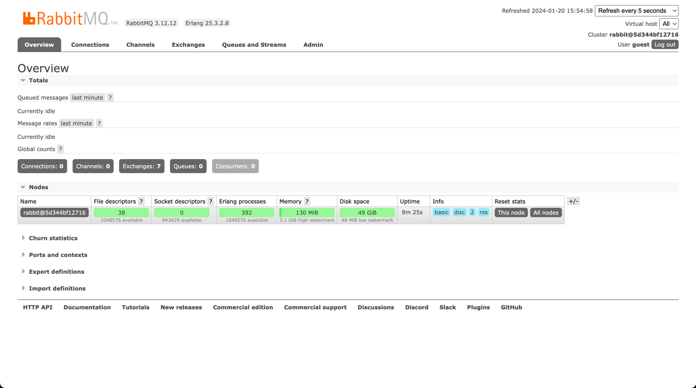
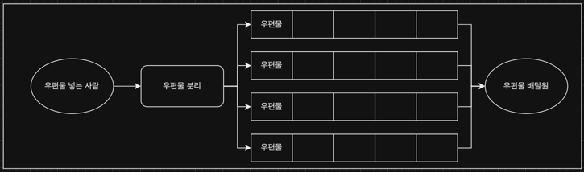
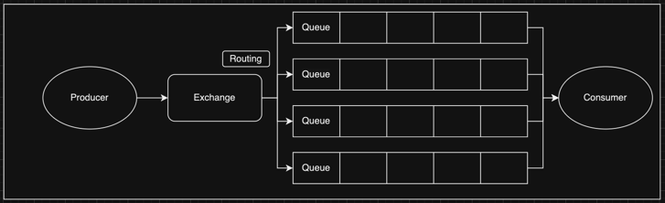
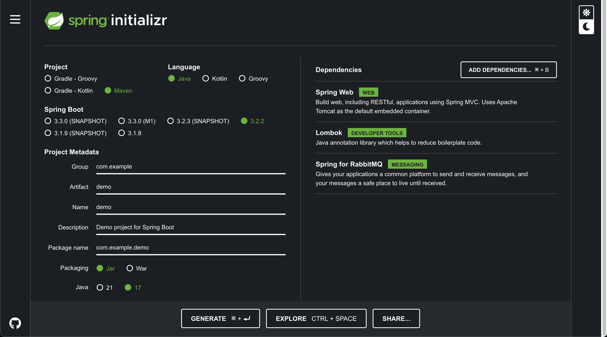

# RabbitMQ 란?

<br/><br/><br/>


## Index
* [RabbitMQ 설치](#RabbitMQ-설치)
* [RabbitMQ 설명](#RabbitMQ-설명)
* [RabbitMQ SpringBoot 환경설정](#RabbitMQ-SpringBoot-환경설정)

<br/><br/><br/>


## RabbitMQ 설치

해당 글은 Docker 환경에서 RabbitMQ를 설치하여 진행한다.  
만약 Docker를 사용하지 않는다면 직접 설치를 해야 한다.  
[RabbitMQ 설치 바로가기](https://www.rabbitmq.com/download.html)

프로젝트의 구조는 아래와 같으며,  
Docker와 Docker Compose가 설치되어 있다면,  
build.sh를 실행하여 RabbitMQ를 설정할 수 있다. (bash build.sh 실행)

```shell
# tree 명령어로 해당 프로젝트 구조 확인
$ tree -L 1
.
├── Dockerfile
├── HELP.md
├── README.md
├── build.sh <-- 실행
├── docker-compose.yml
├── mkdwn
├── mvnw
├── mvnw.cmd
├── pom.xml
├── rabbitmq.iml
├── shutdown.sh
├── src
├── start.sh
└── target


# build.sh를 이용하여 RabbitMQ 이미지 로드 및 실행
$ bash build.sh


### >> Build Docker Images.

[+] Building 3.0s (7/7) FINISHED                                                                                                                                                                                 docker:desktop-linux
 => [internal] load build definition from Dockerfile                                                                                                                                                                             0.0s
 => => transferring dockerfile: 799B                                                                                                                                                                                             0.0s
 => [internal] load .dockerignore                                                                                                                                                                                                0.0s
 => => transferring context: 2B                                                                                                                                                                                                  0.0s
 => [internal] load metadata for docker.io/library/rabbitmq:3.12                                                                                                                                                                 2.9s
 => [auth] library/rabbitmq:pull token for registry-1.docker.io                                                                                                                                                                  0.0s
 => [1/2] FROM docker.io/library/rabbitmq:3.12@sha256:aee570fab0fa9a5b0fead541e91a01b98c4b8158b0d705e3d4131dd22411d15e                                                                                                           0.0s
 => CACHED [2/2] RUN set eux;  rabbitmq-plugins enable --offline rabbitmq_management;  rm -f /etc/rabbitmq/conf.d/20-management_agent.disable_metrics_collector.conf;  cp /plugins/rabbitmq_management-*/priv/www/cli/rabbitmqa  0.0s
 => exporting to image                                                                                                                                                                                                           0.0s
 => => exporting layers                                                                                                                                                                                                          0.0s
 => => writing image sha256:ee3142662c5e210062ad903f74c1c2004469bae8ac04320c4169eea1666be122                                                                                                                                     0.0s
 => => naming to docker.io/study/rabbitmq:0.0.1                                                                                                                                                                                  0.0s

What's Next?
  View a summary of image vulnerabilities and recommendations → docker scout quickview

### >> Done.


### >> Print RabbitMQ Image.

REPOSITORY       TAG       IMAGE ID       CREATED        SIZE
study/rabbitmq   0.0.1     ee3142662c5e   26 hours ago   231MB

### >> Done.


### >> Start RabbitMQ Container.
[+] Building 0.0s (0/0)                                                                                                                                                                                          docker:desktop-linux
[+] Running 2/2
 ✔ Network rabbitmq_default  Created                                                                                                                                                                                             0.0s 
 ✔ Container RabbitMQ        Started                                                                                                                                                                                             0.0s 

### >> Done.
```

<br/>

위 처럼 정상적으로 설치가 완료 되었다면 RabbitMQ에 접속 해보자.  
(해당 RabbitMQ 도커 이미지는 management를 포함하고 있어 화면에서 확인할 수 있다.)

> 주소 : localhost:15672  
> ID : guest  
> PW : guest




<br/><br/><br/>


## RabbitMQ 설명

[참고: RabbitMQ Tutorial - Hello World](https://rabbitmq.com/tutorials/tutorial-one-java.html)

RabbitMQ는 일상에서 쉽게 생각하면 우체국 이다.  
우편물을 우체통에 넣으면 배달원이 우체통에 있는 우편물을 배달하는 구조가 된다.  
여기서 우체통에 우편물을 넣는 사람을 Producer라고 하며,  
우체통은 Queue가 되고 배달원은 Consumer가 된다.

<br/>

우체통에 우편물을 넣으면 우편물을 수거하는 담당자를 Exchange라고 하며,  
담당자는 각 우편물마다 목적지가 다르기 때문에 목적지에 알맞게 우편물을 분리하게 되는데  
분리하는 방식을 Exchange Type 이라고 하며 4가지 방식이 있다.  
분리한 우편물을 목적지에 맞게 분리하여 할당하는 것을 Routing이라고 한다.  

<br/>

RabbitMQ 구조
* Producer (우편물을 넣는 사람)
* Exchange (우편물을 수거하는 담당자)
  * Direct
  * Fanout
  * Topic
  * Headers
* Routing  (우편물을 분리하는 방식)
* Queue (우체통)
* Consumer (우편물을 목적에 맞게 배달하는 배달원)

<br/>

> 현실에서의 RabbitMQ 구조



<br/>

> 프로그램에서의 RabbitMQ 구조



<br/><br/><br/>


## RabbitMQ SpringBoot 환경설정

> [Spring Initializer 접속](start.spring.io)하여 프로젝트 생성



<br/>

> application.properties 또는 application.yml 설정

```text
# application.properties 기준
## RabbitMQ 접속 정보
spring.rabbitmq.host=localhost
spring.rabbitmq.port=5672
spring.rabbitmq.username=guest
spring.rabbitmq.password=guest

## RabbitMQ queue, exchange, routing 이름 설정
rabbitmq.queue.name=rabbit_queue
rabbitmq.exchange.name=rabbit_exchange
rabbitmq.routing.key=rabbit_routing


# application.yml 기준
## RabbitMQ 접속 정보
spring:
  rabbitmq:
    host: localhost
    port: 5672
    username: guest
    password: guest

## RabbitMQ queue, exchange, routing 이름 설정
rabbitmq:
  queue:
    name: rabbit_queue
  exchange:
    name: rqbbit_exchange
  routing:
    key: rabbit_routing
```

<br/>

> RabbitMQConfig 설정 클래스 생성

```java
@Configuration
public class RabbitMQConfig {

    @Value("${rabbitmq.queue.name}")
    private String queue;
    
    @Value("${rabbitmq.queue.json.name}")
    private String exchange;
    
    @Value("${rabbitmq.routing.key}")
    private String routingKey;

    // spring bean for rabbitMQ queue
    @Bean
    public Queue queue() {
        return new Queue(queue); // Queue Name
    }

    // spring bean for rabbitmq exchange
    @Bean
    public TopicExchange exchange() {
        return new TopicExchange(exchange); // Exchange Name
    }

    // binding between queue and exchange using routing key
    @Bean
    public Binding binding() {
        return BindingBuilder.bind(queue())
                .to(exchange())
                .with(routingKey);
    }
}
```

<br/>

> SpringBoot 실행하여 RabbitMQ 실행 로그 확인

```text
  .   ____          _            __ _ _
 /\\ / ___'_ __ _ _(_)_ __  __ _ \ \ \ \
( ( )\___ | '_ | '_| | '_ \/ _` | \ \ \ \
 \\/  ___)| |_)| | | | | || (_| |  ) ) ) )
  '  |____| .__|_| |_|_| |_\__, | / / / /
 =========|_|==============|___/=/_/_/_/
 :: Spring Boot ::                (v2.7.5)

# ...

2024-01-20 18:08:56.977  INFO 30840 --- [           main] o.s.a.r.c.CachingConnectionFactory       : Attempting to connect to: [localhost:5672]
2024-01-20 18:08:56.994  INFO 30840 --- [           main] o.s.a.r.c.CachingConnectionFactory       : Created new connection: rabbitConnectionFactory#753aca85:0/SimpleConnection@5a13fcf3 [delegate=amqp://guest@127.0.0.1:5672/, localPort= 49413]
2024-01-20 18:08:57.052  INFO 30840 --- [           main] com.study.rabbitmq.RabbitmqApplication   : Started RabbitmqApplication in 0.802 seconds (JVM running for 1.019)
```
