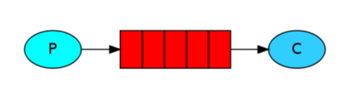
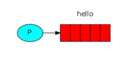
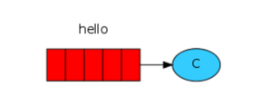

# Producer와 Consumer

<br/><br/><br/>


## Index
* [구조](#간단한-구조)
* [Producer](#Producer)
* [Consumer](#Consumer)

<br/><br/><br/>


## 간단한 구조

  
[참고 사이트](https://rabbitmq.com/tutorials/tutorial-one-java.html)

<br/>

RabbitMQ 구조를 간단하게 표현하자면 위 그림과 같다.  
메시지를 Queue에 전송하는 P (Producer)와  
Queue에서 가져가는 C (Consumer) 구조로 되어 있다.  

[RabbitMQ란?](https://github.com/chaeheedongs/rabbitmq/blob/main/mkdwn/01-concept.md) 페이지에서 설명 하였듯 현실 세계 구조로  
P는 우편을 넣는 사람이 되고 Queue는 우편물이며, C는 배달원이 된다.

<br/><br/><br/>


## Producer

  
[참고 사이트](https://rabbitmq.com/tutorials/tutorial-one-java.html)

<br/>

Producer는 Queue에 hello라는 메시지를 전달하는 구조이다.   

이전에 설정해 놓은 [RabbitMQ SpringBoot 환경설정](https://github.com/chaeheedongs/rabbitmq/blob/main/mkdwn/01-concept.md#RabbitMQ-SpringBoot-%ED%99%98%EA%B2%BD%EC%84%A4%EC%A0%95) 글로 인하여  
스프링 부트가 실행이 되면서 RabbitMQ 관련 빈이 조립되어 올라가 있을 것이다.  

간단하게 hello라는 메시지를 받을 수 있는 Controller 하나를 작성한디.

> Producer Controller Example Code
```java
@Slf4j
@RestController
@RequestMapping("/api/v1")
@RequiredArgsConstructor
public class MessageController {

    private final RabbitMQProducer producer;

    // GET http://localhost:8080/api/v1/publish?message=
    @GetMapping("/publish")
    public ResponseEntity<String> sendMessage(@RequestParam String message) {

        log.info("### >> [rabbit] Request Message -> {}", message);
        producer.publish(message);

        return ResponseEntity.ok("Message Sent to RabbitMQ ...");
    }
}
```

<br/>

Controller를 생성하였다면 해당 메시지를 처리할 수 있도록 Service를 작성한다.  

Service에서는 `RabbitTemplate`을 주입받아 `convertAndSend` 메서드에 전달받은 메시지를 전달한다.  
이때 convertAndSend의 매개변수 값은 exchange와 routingKey와 메시지이다.  

해당 값들은 [RabbitMQ SpringBoot 환경설정](https://github.com/chaeheedongs/rabbitmq/blob/main/mkdwn/01-concept.md#RabbitMQ-SpringBoot-%ED%99%98%EA%B2%BD%EC%84%A4%EC%A0%95) 에서 properties로 설정한 값 이며,  
Service 코드에서 필드로 해당 값들을 읽어 오고 있다.

> Producer Service Example Code
```java
@Slf4j
@Service
@RequiredArgsConstructor
public class RabbitMQProducer {

    @Value("${rabbitmq.exchange.name}")
    private String exchange;

    @Value("${rabbitmq.routing.key}")
    private String routingKey;

    private final RabbitTemplate template;

    public void publish(String message) {

        log.info("### >> [rabbit] Publish Message -> {}", message);
        template.convertAndSend(exchange, routingKey, message);
    }
}

```

<br/>

위의 Controller와 Service코드 작성을 하였다면 테스트를 위해 코드를 작성하고 테스트하여  
로그가 정상적으로 찍히는지 확인해 보자.

> Producer Mock Test Code
```java
@SpringBootTest
@AutoConfigureMockMvc
public class RabbitMockTest {

    @Autowired
    MockMvc mockMvc;

    @Test
    void init() {
        System.out.println("hello RabbitMQ Mock Test");
    }

    @Test
    void PublishAndConsumeTest() throws Exception {

        mockMvc.perform(get("/api/v1/publish")
                                .param("message", "hello RabbitMQ"))
                .andDo(print())
                .andExpect(status().isOk());
    }
}
--------------------------------------------------------------------------------
.   ____          _            __ _ _
/\\ / ___'_ __ _ _(_)_ __  __ _ \ \ \ \
( ( )\___ | '_ | '_| | '_ \/ _` | \ \ \ \
\\/  ___)| |_)| | | | | || (_| |  ) ) ) )
'  |____| .__|_| |_|_| |_\__, | / / / /
=========|_|==============|___/=/_/_/_/
:: Spring Boot ::                (v2.7.5)

2024-01-21 23:30:33.388  INFO 34484 --- [           main] com.study.rabbitmq.RabbitMockTest        : No active profile set, falling back to 1 default profile: "default"
2024-01-21 23:30:34.205  INFO 34484 --- [           main] o.s.b.t.m.w.SpringBootMockServletContext : Initializing Spring TestDispatcherServlet ''
2024-01-21 23:30:34.205  INFO 34484 --- [           main] o.s.t.web.servlet.TestDispatcherServlet  : Initializing Servlet ''
2024-01-21 23:30:34.205  INFO 34484 --- [           main] o.s.t.web.servlet.TestDispatcherServlet  : Completed initialization in 0 ms
2024-01-21 23:30:34.220  INFO 34484 --- [           main] o.s.a.r.c.CachingConnectionFactory       : Attempting to connect to: [localhost:5672]
2024-01-21 23:30:34.258  INFO 34484 --- [           main] o.s.a.r.c.CachingConnectionFactory       : Created new connection: rabbitConnectionFactory#76d72b5b:0/SimpleConnection@2997ddfc [delegate=amqp://guest@127.0.0.1:5672/, localPort= 50190]
2024-01-21 23:30:34.332  INFO 34484 --- [           main] com.study.rabbitmq.RabbitMockTest        : Started RabbitMockTest in 1.086 seconds (JVM running for 1.489)
2024-01-21 23:30:34.512  INFO 34484 --- [           main] c.s.r.controller.MessageController       : ### >> [rabbit] Request Message -> hello RabbitMQ // <-- log 확인
2024-01-21 23:30:34.512  INFO 34484 --- [           main] c.s.rabbitmq.publisher.RabbitMQProducer  : ### >> [rabbit] Publish Message -> hello RabbitMQ // <-- log 확인
```

<br/><br/><br/>


## Comsumer

  
[참고 사이트](https://rabbitmq.com/tutorials/tutorial-one-java.html)

<br/>

Consumer는 Queue에 담겨있는 hello 메시지를 받는다.  

Producer가 넣은 메시지를 간단하게 로그로 찍는 Consumer를 구축하여 받아보자.  

Consumer를 구축할 때는 메서드 위에 `@RabbitListener` 어노테이션을 사용한다.  
`@RabbitListener`는 Consumer가 메시지를 찾을 수 있게 Queue와 관련된 설정을 인자로 추가한다.  

> Consumer Service Example Code
```java
@Slf4j
@Service
public class RabbitMQConsumer {

    @RabbitListener(queues = {"${rabbitmq.queue.name}"})
    public void consume(String message) {
        log.info("### >> [rabbit] Consume Message -> {}", message);
    }
}
```

<br/>

위의 Service코드 작성을 하였다면 테스트를 위해 코드를 작성하고 테스트하여  
로그가 정상적으로 찍히는지 확인해 보자.

> Producer Mock Test Code
```java
@SpringBootTest
@AutoConfigureMockMvc
public class RabbitMockTest {

    @Autowired
    MockMvc mockMvc;

    @Test
    void init() {
        System.out.println("hello RabbitMQ Mock Test");
    }

    @Test
    void PublishAndConsumeTest() throws Exception {

        mockMvc.perform(get("/api/v1/publish")
                                .param("message", "hello RabbitMQ"))
                .andDo(print())
                .andExpect(status().isOk());
    }
}
--------------------------------------------------------------------------------
.   ____          _            __ _ _
/\\ / ___'_ __ _ _(_)_ __  __ _ \ \ \ \
( ( )\___ | '_ | '_| | '_ \/ _` | \ \ \ \
\\/  ___)| |_)| | | | | || (_| |  ) ) ) )
'  |____| .__|_| |_|_| |_\__, | / / / /
=========|_|==============|___/=/_/_/_/
:: Spring Boot ::                (v2.7.5)

2024-01-21 23:30:33.388  INFO 34484 --- [           main] com.study.rabbitmq.RabbitMockTest        : No active profile set, falling back to 1 default profile: "default"
2024-01-21 23:30:34.205  INFO 34484 --- [           main] o.s.b.t.m.w.SpringBootMockServletContext : Initializing Spring TestDispatcherServlet ''
2024-01-21 23:30:34.205  INFO 34484 --- [           main] o.s.t.web.servlet.TestDispatcherServlet  : Initializing Servlet ''
2024-01-21 23:30:34.205  INFO 34484 --- [           main] o.s.t.web.servlet.TestDispatcherServlet  : Completed initialization in 0 ms
2024-01-21 23:30:34.220  INFO 34484 --- [           main] o.s.a.r.c.CachingConnectionFactory       : Attempting to connect to: [localhost:5672]
2024-01-21 23:30:34.258  INFO 34484 --- [           main] o.s.a.r.c.CachingConnectionFactory       : Created new connection: rabbitConnectionFactory#76d72b5b:0/SimpleConnection@2997ddfc [delegate=amqp://guest@127.0.0.1:5672/, localPort= 50190]
2024-01-21 23:30:34.332  INFO 34484 --- [           main] com.study.rabbitmq.RabbitMockTest        : Started RabbitMockTest in 1.086 seconds (JVM running for 1.489)
2024-01-21 23:30:34.512  INFO 34484 --- [           main] c.s.r.controller.MessageController       : ### >> [rabbit] Request Message -> hello RabbitMQ // <-- log 확인
2024-01-21 23:30:34.512  INFO 34484 --- [           main] c.s.rabbitmq.publisher.RabbitMQProducer  : ### >> [rabbit] Publish Message -> hello RabbitMQ // <-- log 확인
2024-01-21 23:30:34.529  INFO 34484 --- [ntContainer#0-1] c.s.rabbitmq.consumer.RabbitMQConsumer   : ### >> [rabbit] Consume Message -> hello RabbitMQ // <-- log 확인
```
